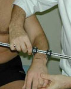
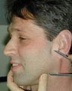
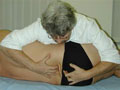
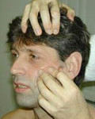

# Behandeltraject

Er is vrije toegankelijkheid voor de manueel therapeut. U heeft dus geen verwijzing nodig van de huisarts of een specialist voor een consult. Een consult bij de manueel therapeut duurt circa 45 tot 90 minuten. Daarbij wordt het volgende uitgevoerd:

1. Intakegesprek
2. Lichamelijk onderzoek
3. Behandeling
4. Afsluitend onderzoek

Gemiddeld leggen patienten 3 a 4 consulten af. Wanneer u de praktijk bezoekt op verwijzing van de huisarts of specialist, krijgt de verwijzend arts na het eerste bezoek een brief met daarin de bevindingen van het eerste onderzoek. Indien de verwijzend arts een specialist is, wordt altijd een kopie van de brief naar de huisarts gestuurd. Als de behandelserie is afgerond, wordt opnieuw een brief gestuurd met daarin de resultaten van de behandeling en eventuele aanbevelingen.

## Intrakegesprek

De manueel therapeut begint met een inventarisatie van de klachten en de gezondheids­toestand. Dat wil zeggen dat er een vraaggesprek wordt gehouden waarin wordt gevraagd naar de klachten, waar en wanneer ze optreden, hoe lang ze al bestaan, waardoor ze worden verergerd of juist minder worden enz. Ook kan gevraagd worden naar andere aandoeningen of ziektes, eerdere behandelingen, terwijl ook zaken als werk- en privé-omstandigheden aan bod kunnen komen. Onderzoeksresultaten van derden, waaronder röntgenfoto’s, scans e.d. worden ook hierbij betrokken.

## Lichamelijk Onderzoek

Hierna volgt een algemeen onderzoek, waarbij de manueel therapeut ondermeer de stand en mobiliteit van de patiënt bekijkt, overigens zonder hieraan een waarde oordeel te geven. Het algemeen lichamelijk onderzoek dient slechts om de toestand vóór en na een behandeling te kunnen vergelijken (dit geldt evenzeer voor de anamnese).

Meting van de polsbreedte

Meting van de kaaklengte

Het onderzoek wordt aangevuld met bepaalde testen voor voorkeursbewegingen, bijvoorbeeld hoe u spit, de handen vouwt, de kleermakerszit aanneemt) en het meten van de asymmetrie van het lichaam (links-rechts verschillen), de individuele bouw en functie vastgesteld. Met behulp van schema­boeken worden aan de hand van deze metingen de individuele bewegingspatronen van de gewrichtsketens bepaald. Bij iedere behandeling worden, omdat daarin veranderingen kunnen optreden, de metingen opnieuw verricht om die van een voorgaande behandeling te verifiëren.

## Behandeling

Op basis van de verkregen gegevens wordt duidelijk hoe de manueel therapeut de gewrichten moet bewegen. Het door de therapeut bewegen van de botstukken gebeurt door een lichte druk uit te oefenen op de botten, waarbij steeds het ene bot wordt bewogen en het aangrenzende botstuk wordt geremd in de beweging. De manier van bewegen is afhankelijk van de vorm van de gewrichten en komt overeen met hetgeen uit de bewegingsanalyse is berekend. 

Behandeling van de lendenwervelkolom

Schedelbehandeling

Getracht wordt daarmee de optimale beweging in de gewrichten te herstellen, waardoor de patiënt weer in staat zal zijn elke houding probleemloos aan te nemen of elke beweging weer zonder moeite uit te voeren. Het gevolg daarvan is dat pijnlijke structuren zich herstellen.

## Afsluitend Onderzoek

Na de behandeling wordt door de therapeut een evaluerende toets gedaan naar het directe resultaat van de behandeling. Dit gebeurt door een aantal bevindingen uit het algemeen lichamelijk onderzoek te herhalen. Verder wordt de patiënt voorgelicht over de te verwachten reacties op de behandeling.