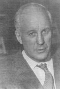

# Historie

De manuele therapie werd na jarenlang empirisch en theoretisch onderzoek als behandelmethode geïntroduceerd door G. van der Bijl senior (1909-1977). Nadat hij de osteopathie en de chiropractie had bestudeerd (hij verwierf de osteopathische titel ‘DO’ – Doctor of Osteopathy – en ontving de Europese Prijs voor Osteopathische Research’ in 1965) bracht hij met name het ‘manuele’ deel in de praktijk. Reeds toen gaf hij de voorkeur aan de wat zachtere osteopathische behandelingstechnieken boven de agressievere chiropractische ‘adjustments’.

G. van der Bijl Senior

In een streven naar vervanging van de in zijn ogen onbetrouwbare subjectieve onderzoekmethodieken ontwikkelde G. van der Bijl een volstrekt eigen visie op de menselijke bewegingsfuncties. Het is zijn grote verdienste geweest dat hij de complexiteit van de individuele bewegingsfunctie modelmatig trachtte te benaderen. Hij was van opvatting dat het menselijk functioneren, met behulp van mechanische wetten en axioma’s, in een individueel functiemodel uiteindelijk weer te geven en te begrijpen zou zijn.

In dit model, het ‘individuele bewegingspatroon’, werd gepoogd een relatie in individuele bouw en individuele bewegingsfunctie te beschrijven. Hierbij werd aan het streven van het menselijk lichaam naar optimale evenwichtssituaties in verhouding tot de zwaartekracht een bepalende factor toegekend: de zwaartekracht is effectief op het totale bewegingsapparaat; individueel verschillende oriëntaties van deelzwaartepunten in het bewegingsapparaat initiëren individueel verschillende bewegingsfuncties.

Vanuit deze visie kwam men tot een gedisciplineerde onderzoektechniek: het individuele bewegingspatroon werd bepaald na theoretische analyse van metingen van asymmetrische bewegingsfuncties en (naderhand) asymmetrie in bouw. Hierbij werd aan de eis voldaan dat de diagnostiek moet berusten op objectieve criteria.

In 1963 werd het initiatief genomen tot het starten van een opleiding. De Stichting School voor Manuele Therapie werd opgezet als opleiding voor fysiotherapeuten en artsen tot een nieuwe, professionele behandelwijze, de manuele therapie. Deze term werd na zorgvuldige afweging gekozen. Ter onderscheiding van de ‘manuele geneeskunde’, ‘manuelle Medizin’, ‘manual medicine’ enz. werd via de naam ‘manuele therapie’ uitdrukking gegeven aan de opvatting dat men niet streeft naar lokale benadering van één of meer gewrichten in de wervelkolom, waarbij men zou genezen door ‘recht’ te maken wat ‘scheef’ is of ‘normaal’ wat ‘abnormaal’ zou zijn.

Daarentegen is de essentie van de manueel-therapeutische behandeling het streven naar adequate therapeutische ‘hulpverlening’ door middel van optimaliseren van het totaal aan bewegingsfuncties in een, per individu verschillende, (asymmetrische) presentatie in bouw en functie. Illustratief hierbij is de Griekse term ‘therapeutes’, die ‘dienaar, verzorger’ betekent. Ook werd door de keuze van het woord ‘therapie’ aangegeven dat naast geneeskundigen ook paramedici, in casu fysiotherapeuten, uit hoofde van hun vooropleiding in principe, na adequate opleiding, geschikt kunnen worden geacht voor dit therapeutisch ‘handwerk’, dat aan de hand van specifieke diagnostiek wordt uitgevoerd.

Na het overlijden van G. van der Bijl werd het theoriestelsel, de diagnostiek en de behandeltechniek verder ontwikkeld en van een wetenschappelijke basis voorzien door zijn zoon G. van der Bijl jr. en anderen.

De laatste decennia zijn anderen uit de wereld van de fysiotherapie en de geneeskunst hun, soms hardhandige, werkwijze ook als manuele therapie gaan betitelen. Dit is vanwege de fundamentele verschillen in achtergrondfilosofie, theoriestelsel, onderzoekmethode, behandeltechniek en behandelresultaten onterecht en voor velen verwarrend.

De manuele therapie volgens de methode Van der Bijl is als enige methode op dit gebied in staat te werken volgens sterk geobjectiveerde criteria ten aanzien van het individuele menselijke bewegen, waardoor een zekere standaardisatiegraad wordt bereikt. De behandelaar is hierdoor in staat steeds dezelfde behandelingskwaliteit te leveren en is bovendien in staat om interindividuele behandelingsverschillen tot een minimum te beperken.

Bron: ‘Het individuele functiemodel in de manuele therapie’, G. van der Bijl, 1986, De Tijdstroom, Lochem