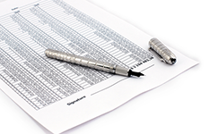

<!--  Overzicht -->
<section class="text-gray-700 body-font">
    

        

            

                <h1 class="sm:text-3xl text-2xl font-medium title-font mb-2 text-gray-900">
                    Patiëntenvereniging Manuele Therapie E.S</h1>
                

            

            
De Patiëntenvereniging Manuele Therapie E.S.
                (afgekort de PVMT) behartigt de patiëntenbelangen van manueel therapeuten die werken volgens het
                eggshell specialisme.

        

        

            

                

                    <a href="manueletherapie.html">
                        
                        <h3 class="tracking-widest text-pink-500 text-xs font-medium title-font">Wat is</h3>
                        <h2 class="text-lg text-gray-900 font-medium title-font mb-4">Methodiek</h2>
                        
Manuele Therapie E.S.® is een behandelwijze die zich richt
                            op de behandeling van klachten van het bewegingsapparaat, of klachten die daarvan zijn
                            afgeleid.

                    </a>
                

            

            

                

                    <a href="behandeltraject.html">
                        
                        <h3 class="tracking-widest text-pink-500 text-xs font-medium title-font">Hoe werkt</h3>
                        <h2 class="text-lg text-gray-900 font-medium title-font mb-4">Behandeltraject</h2>
                        
Een verwijzing van de huisarts of een specialist is niet
                            nodig. Een consult duurt circa 45 tot 90 minuten. Gemiddeld leggen patienten 3 a 4 consulten
                            af. 

                    </a>
                

            

            

                

                    <a href="historie.html">
                        
                        <h3 class="tracking-widest text-pink-500 text-xs font-medium title-font">Wanneer werd</h3>
                        <h2 class="text-lg text-gray-900 font-medium title-font mb-4">Historie</h2>
                        
Na jaren van empirisch en theoretisch onderzoek legde G.
                            van der Bijl senior (1909-1977) de grondbeginselen vast van Manuele Therapie E.S.® . 

                    </a>
                

            

            

                

                    <a href="vergoedingen.html">
                        
                        <h3 class="tracking-widest text-pink-500 text-xs font-medium title-font">Hoeveel kost</h3>
                        <h2 class="text-lg text-gray-900 font-medium title-font mb-4">Zorgvergoedingen</h2>
                        
Een aantal Nederlandse zorgverzekeraars dekken Manuele Therapie E.S.® in hun aanvullende zorgverzekeringen.

                    </a>
                

            
 
        

    

</section>

<!-- Lid worden -->
<section class="text-gray-700 body-font">
    

        

            <h1 class="title-font font-medium text-3xl text-gray-900">Lid zijn is kostenloos</h1>
            

                Als lid word je als eerste op de hoogte gebracht van alle nieuwtjes omtrent de Manuele Therapie E.S.
                behandelmethode. Tevens oefen je als lid direct invloed uit op onze activiteiten. Lid worden is
                makkelijk: laat je interesse horen en onze secretaris neemt dan contact met je op.
            

            

                <a href="contact.html">
                    <button class="flex mx-auto text-white bg-pink-500 border-0 py-2 px-8 focus:outline-none hover:bg-gray-600 rounded text-lg">
                        Ja, ik wil meer weten!
                    </button>
                </a>
            

        

    

</section>