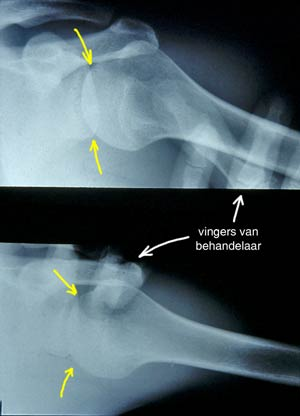
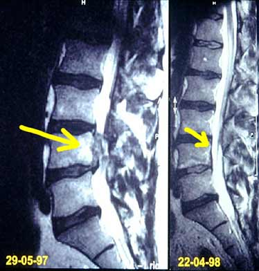

# Over Manuele Therapie E.S.

Manuele Therapie E.S.® is een behandelwijze die zich richt op de behandeling van klachten van het bewegingsapparaat, of klachten die daarvan zijn afgeleid. Deze behandelwijze houdt rekening met individuele verschillen en asymmetriën. 

Manuele therapeuten E.S.® trachten uitsluitend door gebruik van handgrepen (i.e. manueel) een optimale bewegingsfunctie te realiseren en te handhaven. Hierbij wordt zeer subtiel en meestal pijnloos gewrichten in het lichaam bewogen. De methode wordt ook wel de eggshell (E.S.®) methode genoemd. De kracht die bij de behandeling wordt gebruikt is zo gering, dat een eierschaal nog niet zou breken. Er wordt dus niet gekraakt. 

> 
>   Invloed van de behandeltechniek op de verplaatsing van botstukken in een schoudergewricht. De vingers zijn van de behandelaar. 
>   Bron: Hans Vuurmans, Nederhorst den Berg.

Daarnaast onderscheidt Manuele Therapie E.S.® zich van andere (vertebrale) therapievormen met haar totaalbehandeling. 

Ieder mens is herkenbaar aan zijn eigen bouw, zijn eigen houding en zijn eigen manier van bewegen en heeft zodoende zijn individuele bewegingspatroon. Bewegen vindt plaats in de gewrichten. Centraal in de manuele therapie staat het verbeteren van de gewrichtsbewe­gingen in het hele lichaam. De uitvoering van bewegingen is afhankelijk van de vorm van de gewrichten. Vorm en functie zijn aan elkaar gekoppeld: mede door het bewegen wordt de vorm bepaald die onze gewrichten krijgen en door de ontstane vorm hebben we voorkeursbe­wegingen. 

Bij klachten in het bewegingsapparaat reageert een gewricht niet meer adequaat op een gevraagde functie, waardoor het individuele bewegingspatroon verstoord raakt. De manuele therapie richt zich op het herstellen van de verstoorde relatie tussen vorm en functie. Het bewegingsapparaat, waartoe alle gewrichten van het menselijk lichaam behoren met hun bijbehorende spieren en zenuwen, is een eenheid en functioneert ook als zodanig. Binnen deze functionele eenheid kunnen één of meer functiestoornissen op verschillende locaties aanwezig zijn. Om deze reden worden tijdens een behandeling alle bewegingsketens, dus het lichaam in zijn totaliteit, behandeld.

> 
>   Een hernia op de foto links. Op de rechter foto dezelfde wervelkolom een jaar later. De hernia is zonder operatie verdwenen.
>   Bron: Hans Vuurmans, Nederhorst den Berg.

Een aantal voorbeeld indicaties die door een manueel therapeut kunnen worden behandeld:

* rug- en nekpijn
* ischias
* hernia
* bekkenpijn
* gevolgen van arthrosis
* gewrichtspijn, zoals schouderpijn, tennisarm, knieklachten
* stralingspijn vanuit de nek naar de arm
* stralingspijn vanuit de rug naar het been
* bepaalde vormen van hoofdpijn en duizeligheid
* bepaalde vormen van pijn op de borst of in de oksel

Bij het eerste consult bespreekt de manueel therapeut aan de hand van het intakegesprek en uitgebreid onderzoek de klachten door middel van manuele therapie gunstig te beïnvloeden zijn.
